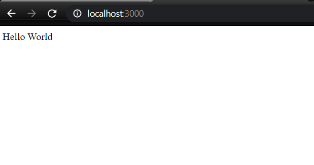

# Basic Express Website

**Express** is a module in node.js which gives a full framework. It gives a routing system and a http server.

To Install Express use the command:
`npm install -g express`

I have used g flag to install express globally.

We are also going to use **JADE** which is a template engine. It wors well with express.

We are also going to use **body-parser** module that will help to parse data including form data

## Steps to be followed

1. Make a `package.json` file. Use this command: `npm init`
2. Now we need to append the `package.json` file to add the dependencies like nodemailer,bodyparser,express and jade.
3. After adding dependencies we need to install them. Use command `npm install`. This will also create a folder named `node modules` which will have our dependencies.
4. Now write in `app.js` file.
5. We can see the output using command: `node app.js` 

## Findings

### Flow of the Javascript code:
So the four steps that we follow in our js file is:
1. First we create express application.
2. Create a new route.
3. Starting an HTTP server at given port.
4. Handling the request once it comes.

[source](https://www.sohamkamani.com/blog/2018/05/30/understanding-how-expressjs-works/)

### What is Routing

Roting determines which handler will recieve the request. A handler is a function dedicated to receiving and acting on certain requests. We need two information to route our requests:
1. The HTTP request method(eg. get,post,put)
2. The request path

So a route is combination of HTTP method,path and handler. Routes are created to server before it starts listening for requests.

[source](https://perfect.org/docs/routing.html#:~:text=Routing,%2C%20path%2C%20and%20handler%20combination.)

### Why do we use body parser? What is it!

Let's say that I am sending a html data to node-js server i.e. I made a request to the server. But now if I console log this request object in my server file I should see this data in it but actually I don't. This is because http sends our dara in bits and pieces which gets assembeled as they reach their destination.

Now why should we always try to parse this data into pieces and assemble it manually.

So we use body-parser which does this for me.

body-parser parses my request and converts it into a format from which relevant information can be easily extracted.

[source](https://stackoverflow.com/questions/38306569/what-does-body-parser-do-with-express#:~:text=js%20version%204%20and%20above,body%20.&text=This%20body%2Dparser%20module%20parses,submitted%20using%20HTTP%20POST%20request.)

