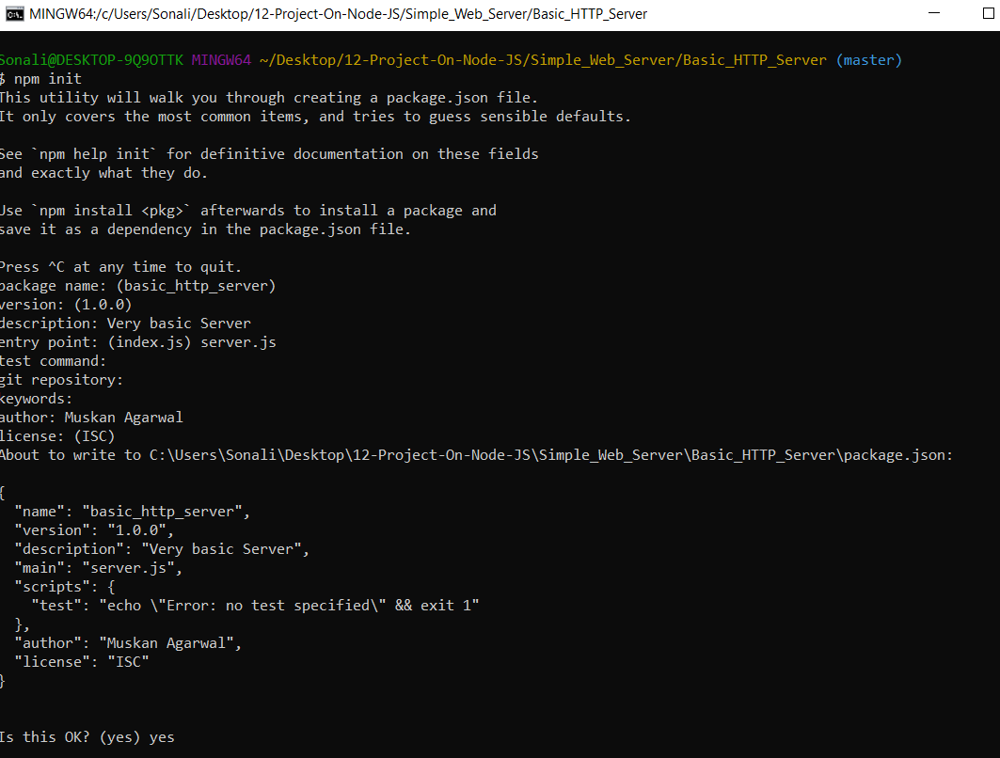
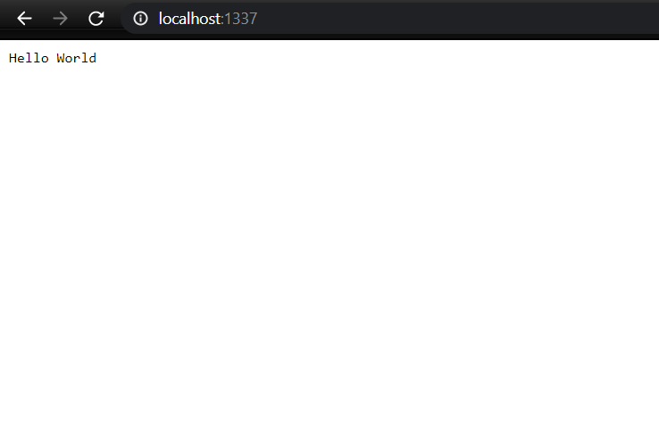

# Steps followed to make a basic HTTP server.

1. First Install node.js in your pc from this [link](nodejs.org)
2. After this we need to go to our application direcctory which is Basic_HTTP_Server for me.
3. Now All node.js application must have a file called `Package.json`.This is a JSON file which holds a lot of different information like application name,description and also we have to list all the dependency modulesthat we want to use.I am going to use `Git Bash` for the same.

      a.Use the command `npm init` in the git bash.
       
      b.Fill in the details as shown in the below image.
      

This will create the `Package.json` file in this directory.

4. Now we will create the `server.js` file.
5. I used the code from `nodejs.org` website for js file.
6. After completing the server.js file we can just run this using command `node server.js` or `npm start`.
7. Now you can see your output on `localhost:1337`.

