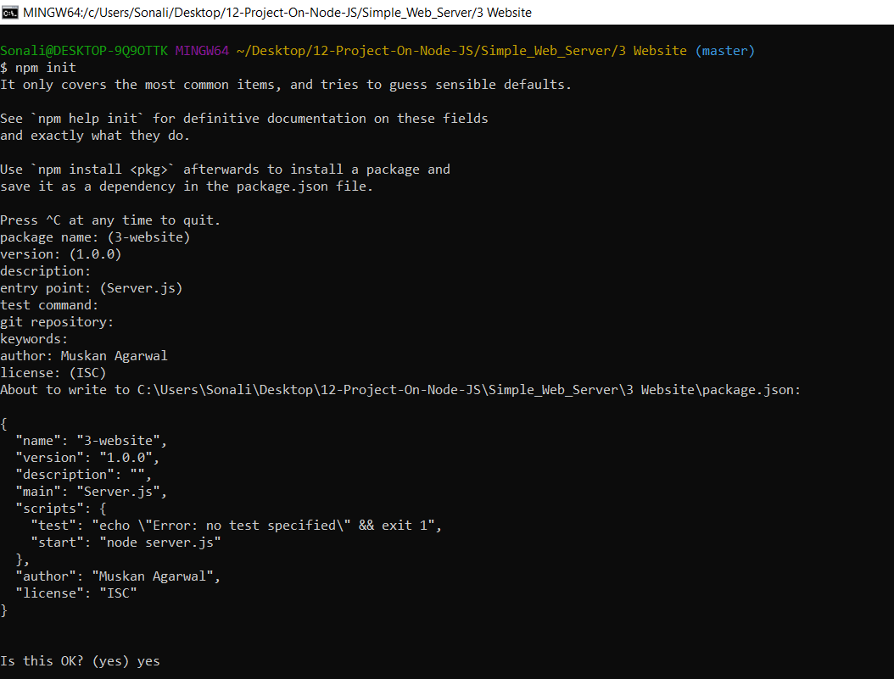

# Steps followed to now make a website.

Note: I have made a very basic html page to learn it's functions.

1. First we need to go to our application direcctory which is `3 Website` for me.
3. Now All node.js application must have a file called `Package.json`.This is a JSON file which holds a lot of different information like application name,description and also we have to list all the dependency modulesthat we want to use.I am going to use `Git Bash` for the same.

      a.Use the command `npm init` in the git bash.
       
      b.Fill in the details as shown in the below image.
      

This will create the `Package.json` file in this directory.

4. Now we will create the `BasicServer.js` file.
6. After completing the `BasicServer.js` file we can just run this using command `node server.js` or `npm start`.
7. Now you can see your output on `localhost:1337`.Since I redirected this to `index.html` file we will see that.

