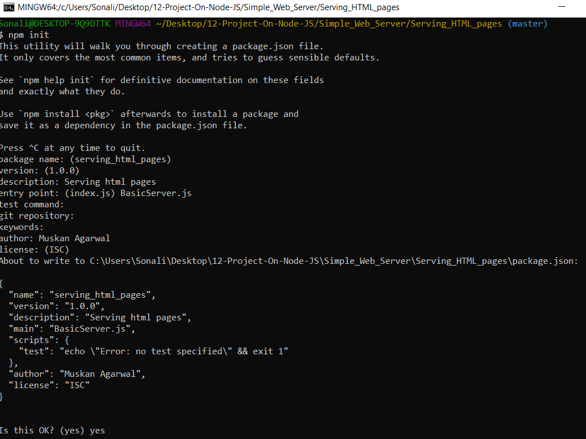
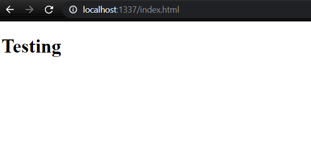
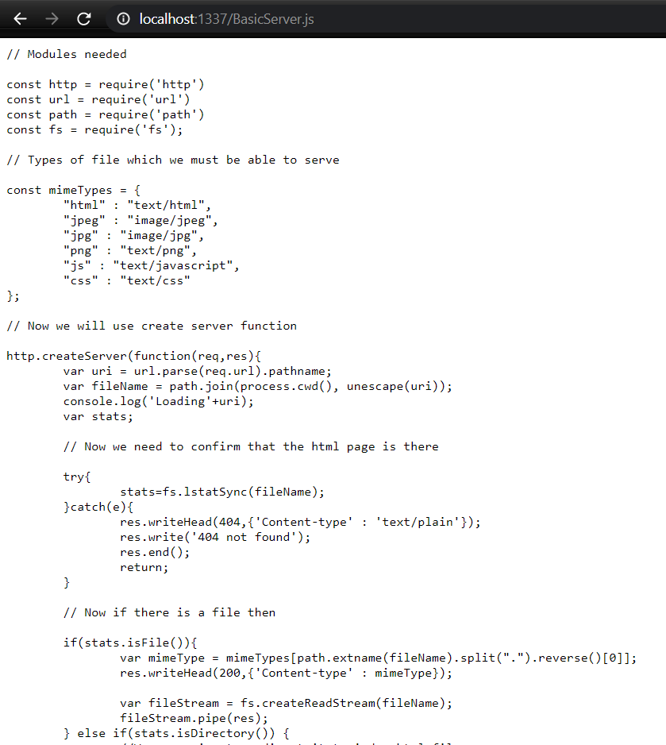

# Steps followed to now serve HTML pages.

1. First we need to go to our application direcctory which is ``Serving_HTML_pages` for me.
3. Now All node.js application must have a file called `Package.json`.This is a JSON file which holds a lot of different information like application name,description and also we have to list all the dependency modulesthat we want to use.I am going to use `Git Bash` for the same.

      a.Use the command `npm init` in the git bash.
       
      b.Fill in the details as shown in the below image.
      

This will create the `Package.json` file in this directory.

4. Now we will create the `BasicServer.js` file.
6. After completing the `BasicServer.js` file we can just run this using command `node server.js` or `npm start`.
7. Now you can see your output on `localhost:1337`.Since I redirected this to `index.html` file we will see that.


8. You can also see a jpeg,jpg,png,js file as well by just using `localhost:1337/file_name`.


# Findings

1. uri variable -> Uniform Resource Identifier (URI) is a string of characters used to identify a resource. This contains whatever file is loading there in the url.
2. `.parse` function in url
 So we can parse the url. URL string has the following parts:
```
Url {

  protocol: null,
  
  slashes: null,
  
  auth: null,
  
  host: null,
  
  port: null,
  
  hostname: null,
  
  hash: null,
  
  search: null,
  
  query: null,
  
  pathname: '/index.html',
  
  path: '/index.html',
  
  href: '/index.html'
  
  }
```
Now here we wanted the pathname,so I used `var uri = url.parse(req.url).pathname;`

3. `Unescape` function -> The unescape() function in JavaScript takes a string as a parameter and use to decode that string encoded by the escape() function. The hexadecimal sequence in the string is replaced by the characters they represent when decoded via unescape().

4. `process.cwd` -> This returns the current working directory.
5. `fs.lstatSync(fileName)` -> Return a stats object which has some information about the file.
6. `.writeHead` -> It is used to write the header of the response, that the application will serve to the client. 
7. `end()` -> Thus method both sends the content of the response to the client and signals to the server that the response (header and content) has been sent completely. 
8. If you are still going to send anything else, you should call `write()` method of res response object instead.
9. `HTTP response codes` 
     1. 302 - Found
This response code means that the URI of requested resource has been changed temporarily
     2. 404 - Not Found
The server can not find the requested resource.
     3. 500 Internal Server Error
The server has encountered a situation it doesn't know how to handle.
     4. 200 OK
The request has succeeded
